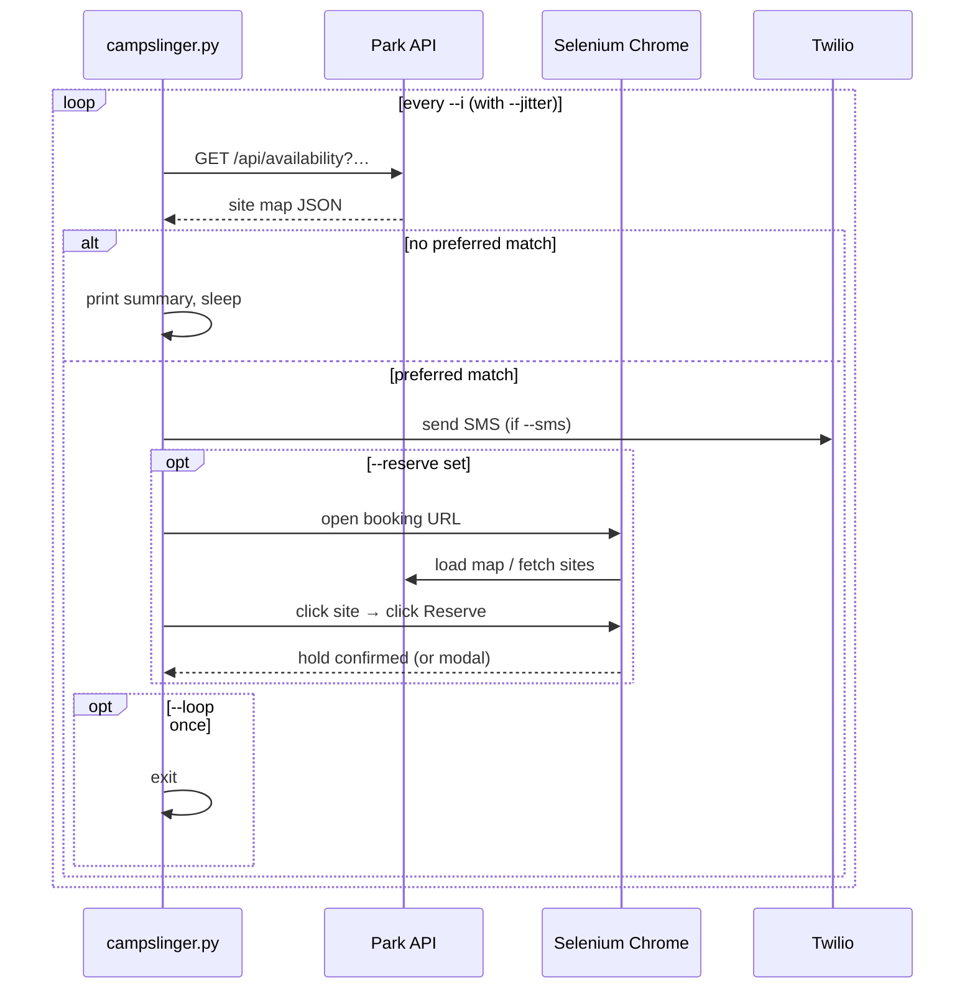
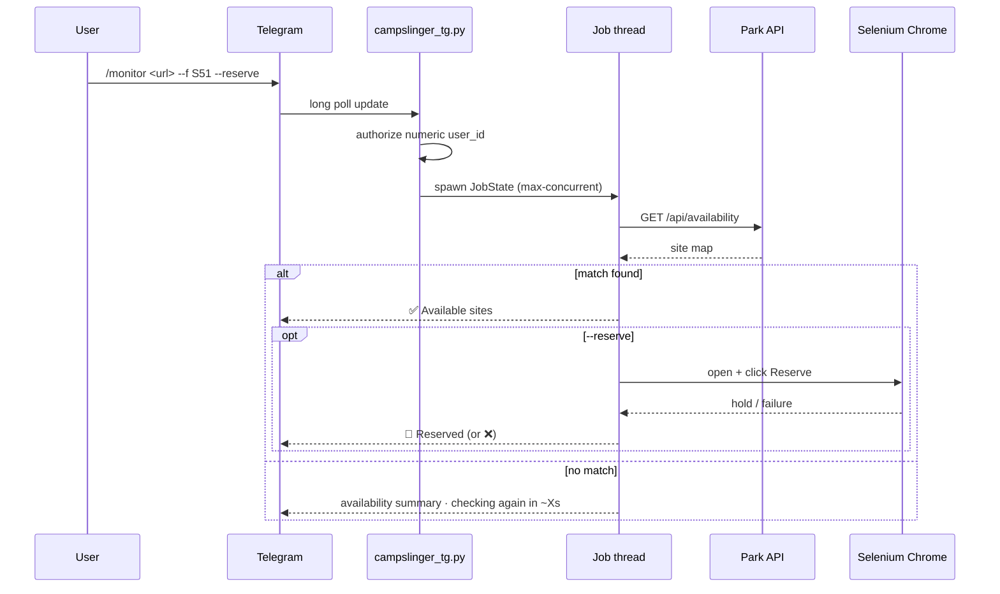

# 🏕️ campslinger

[](https://www.python.org/)
[](#-requirements)
[](#-supported-parks)
[](#%EF%B8%8F-policies--disclaimer)

**Campsite monitoring and reservation helpers for Linux.**
Watch availability via the public API, get notified when sites open up, and optionally automate the Reserve click with Selenium — from the terminal or a Telegram bot. Works with any park on the **Aspira / GoingToCamp** platform (BC Parks, Ontario Parks, Parks Canada, and many more).

```bash
python3 campslinger.py --url 'https://camping.bcparks.ca/create-booking/results?…' --f S51 --i 30
```

> [!NOTE]
> Tested on Debian / Ubuntu Linux. Other Linux distros (e.g. openSUSE) work but aren't covered step-by-step. Windows / macOS aren't covered.

---

## 📑 Contents

| Section | What you get |
|---|---|
| [Requirements](#-requirements) | Python, OS, optional Chrome. |
| [Supported parks](#-supported-parks) | Platforms and hostnames that work out of the box. |
| [Quick start](#-quick-start) | Clone → install → first monitor in 60 seconds. |
| [CLI: campslinger.py](#%EF%B8%8F-cli-campslingerpy) | Monitor-first; opt-in `--reserve`, warmode, SMS. |
| [Telegram bot: campslinger_tg.py](#-telegram-bot-campslinger_tgpy) | Same features, controlled from your phone. |
| [Chrome setup](#-chrome-setup) | Only needed when `--reserve` is used. |
| [Hold vs finishing your booking](#-hold-vs-finishing-your-booking) | What a successful Reserve click actually does. |
| [Troubleshooting / FAQ](#-troubleshooting--faq) | Common issues and fixes. |
| [Archive](#-archive) | Legacy scripts kept for reference. |
| [More docs](#-more-docs) | Deep-dive design notes. |
| [Policies & disclaimer](#%EF%B8%8F-policies--disclaimer) | Fair use, rate limits, disclaimer. |

---

## 🧰 Requirements

| Component | Version | Notes |
|---|---|---|
| **Python** | `>= 3.9` | Constrained by `python-telegram-bot >= 21.0`. |
| **pip** | recent | Used to install `requirements.txt`. |
| **OS** | Linux | Tested on Debian / Ubuntu. Other distros usually fine. |
| **Google Chrome + ChromeDriver** | matching majors | Only required when `--reserve` is used. See [Chrome setup](#-chrome-setup). |
| **Telegram bot token** | optional | Only required for `campslinger_tg.py`. |
| **Twilio account** | optional | Only required if you enable SMS. |

---

## 🌍 Supported parks

All listed parks share the same Aspira / GoingToCamp API and booking UI; only the hostname differs. The bot and CLI accept any URL whose host is on this allowlist.

| Park system | Hostname |
|---|---|
| **BC Parks** (Canada) | `camping.bcparks.ca` |
| **Ontario Parks** (Canada) | `reservations.ontarioparks.ca` |
| **Parks Canada** | `reservation.pc.gc.ca` |
| **Manitoba Parks** (Canada) | `camping.manitobaparks.com` |
| **Nova Scotia Parks** (Canada) | `camping.novascotia.ca` |
| **New Brunswick Parks** (Canada) | `camping.nbparks.ca` |
| **Newfoundland & Labrador** (Canada) | `camping.nlcamping.ca` |
| **Yukon Parks** (Canada) | `yukon.goingtocamp.com` |
| **Michigan** (USA) | `midnrreservations.com` |
| **Maryland** (USA) | `parkreservations.maryland.gov` |
| **Mississippi** (USA) | `mississippi.goingtocamp.com` |
| **Nebraska** (USA) | `nebraska.goingtocamp.com` |

> [!TIP]
> Missing a park? If it uses the same `/create-booking/` URL pattern and API, adding the hostname to `SUPPORTED_PARK_HOSTS` in [campslinger/util.py](campslinger/util.py) is a one-line change.

---

## 🚀 Quick start

```bash
git clone https://github.com/Mukrosz/campslinger.git
cd campslinger
python3 -m venv venv
source venv/bin/activate
pip install -r requirements.txt
```

In every new shell, re-activate before running:

```bash
cd campslinger && source venv/bin/activate
```

Run your first monitor (no Chrome needed):

```bash
# BC Parks
python3 campslinger.py --url 'https://camping.bcparks.ca/create-booking/results?…'

# Ontario Parks, polling every 30 s, only sites S51 and S52
python3 campslinger.py \
  --url 'https://reservations.ontarioparks.ca/create-booking/results?…' \
  --f S51,S52 --i 30
```

<details>
<summary>Sample terminal output (interactive shell)</summary>

```text
2026-06-15 02:31:55 - [Kikomun Creek Provincial Park | jun15-jun20 | s51,s52] No availability. Checking again in ~64s
2026-06-15 02:32:59 - [Kikomun Creek Provincial Park | jun15-jun20 | s51,s52] ✅ Available sites: s51
```

</details>

<details>
<summary>Sample output under systemd / journalctl (no duplicate timestamp)</summary>

When `campslinger_tg.py` runs as a systemd service, journald adds its own timestamp and the script suppresses its prefix automatically:

```text
Jun 15 02:31:55 campoor python3[139657]: [Kikomun Creek Provincial Park | jun15-jun20 | s51,s52] No availability. Checking again in ~64s
```

Force the script timestamp back with `--log-timestamp` on the `ExecStart=` line if you prefer both.

</details>

---

## 🖥️ CLI: campslinger.py

### Modes at a glance

| Mode | Selenium? | Behaviour |
|------|:---:|-----------|
| **Monitor** *(default)* | No | Polls the park API for availability. Prints matching sites. |
| **Reserve** (`--reserve`) | Yes | Same polling, but on hit opens Chrome, finds the site on the map, clicks **Reserve**. |
| **Warmode** (`--reserve --warmode`) | Yes | No API polling. Prefetches the map at 06:59 in `--timezone` (default US/Pacific), clicks **Reserve** at 07:00 (with optional `--warmode-click-delay`). |

On start the CLI prints a one-line banner (mode, park, stay, interval, filter, loop, timezone, SMS). `SIGTERM` (e.g. `systemctl stop`) shuts monitor and reserve loops down cleanly. In continuous monitor mode, SMS is sent only when the set of available preferred sites **changes**, not on every poll, to avoid duplicate paid messages.

### Monitor → Reserve flow



### Common recipes

```bash
# Monitor only (no Chrome)
python3 campslinger.py --url '…'

# Filtered, faster polling
python3 campslinger.py --url '…' --f S51,S52 --i 30

# Stop after first hit
python3 campslinger.py --url '…' --f S51 --loop once

# Reserve on hit
python3 campslinger.py --url '…' --f S51 --reserve

# Warmode (07:00 US/Pacific) with 400 ms safety delay
python3 campslinger.py --url '…' --f S51 --reserve --warmode --wcd 400

# Visible Chrome window (debugging)
python3 campslinger.py --url '…' --reserve --headed

# Attach to your remote Chrome on the LAN
python3 campslinger.py --url '…' --reserve --rip 192.168.1.50 --rp 9222

# SMS notification on availability (monitor or reserve)
python3 campslinger.py --url '…' --sms --tsid X --tat X --tn X --mpn X
```

### Flags reference

| Flag (long / aliases) | Default | Description |
|---|---|---|
| `--url` / `--u` | *(required)* | Full park create-booking results URL on a [supported host](#-supported-parks). |
| `--interval` / `--i` | `60` | Seconds between API polls. Ignored in warmode. |
| `--jitter` / `--ij` | `10` | Random ± variance around `--interval` (e.g. 50–70 s). |
| `--filter` / `--f` | *(all sites)* | Comma-separated preferred site labels. **Order = priority** (the first available label wins on Reserve). |
| `--reserve` / `--r` | off | Enable Selenium reservation on hit. |
| `--loop` | `continuous` | `continuous` or `once` (stop after first hit). |
| `--warmode` / `--w` | off | 07:00 US/Pacific timed Reserve. **Requires `--reserve`.** |
| `--warmode-click-delay` / `--wcd` | `0` | Milliseconds to wait **after** 07:00 before clicking Reserve. **Only with `--warmode`.** |
| `--debug` / `--d` | off | Selenium diagnostics: descriptive screenshots `ss_<ts>_<park>_<stay>_{bcr,acr,acs,mapfail}.png` and map-failure HTML. **No-op without `--reserve`** (a stderr note is emitted). |
| `--headed` | off | Show Chrome window. **Requires `--reserve`.** |
| `--timezone` | `US/Pacific` | IANA timezone for warmode (e.g. `America/Toronto`). |
| `--remote_ip` / `--rip` | — | Chrome remote-debugging host (your own browser on the LAN). Use with `--rp`. |
| `--remote_port` / `--rp` | — | Chrome remote-debugging port (e.g. `9222`). |
| `--sms` / `--s` | off | Send SMS on availability. Requires the Twilio flags below. |
| `--twilio_sid` / `--tsid` | — | Twilio Account SID. |
| `--twilio_auth_token` / `--tat` | — | Twilio auth token. |
| `--twilio_number` / `--tn` | — | Twilio sending phone number (E.164 format, e.g. `+15555550100`). |
| `--my_phone_number` / `--mpn` | — | Your destination number (E.164 format). |
| `--log-timestamp` | auto | Force a `YYYY-MM-DD HH:MM:SS -` prefix on every log line. |
| `--no-log-timestamp` | auto | Omit the script timestamp. **Default under systemd journald** (`JOURNAL_STREAM` set). |

Log lines include a context prefix when park/dates are known: `[Park Name | jun15-jun20 | s51,s52] message`.

### Booking URL

To get the URL:

1. Visit the park's reservation site (e.g. [BC Parks](https://camping.bcparks.ca/create-booking/), [Ontario Parks](https://reservations.ontarioparks.ca/create-booking/)).
2. Choose park, dates, equipment, and search.
3. On the **map / results** page, copy the **full** URL from the address bar.

The URL is validated by `validate_booking_url()` ([campslinger/util.py](campslinger/util.py)) and must satisfy **all** of the following:

- Scheme is `https` (not `http`).
- Hostname is on the [supported-parks](#-supported-parks) allowlist.
- Path starts with `/create-booking/`.
- No embedded credentials (`https://user:pass@…` is rejected).
- Default port `443` (no `:8443` etc.).

---

## 📱 Telegram bot: campslinger_tg.py

Same features as the CLI, controlled from Telegram. **`/menu` is the single hub** (jobs + every action as buttons); monitoring is the primary action and Auto-reserve is an opt-in toggle in the wizard. Works with all supported park platforms.

### Feature matrix

| Feature | Default | How to enable |
|---|---|---|
| 📡 **Monitor** | always on | Tap **📡 Monitor** (in `/menu`) or send `/monitor <url>` / a plain booking URL. |
| ⛺ **Auto-reserve** | off | Toggle in More menu, or send `--reserve`. |
| 🔄 **Loop** | continuous | More menu, or `--loop once`. |
| 📱 **SMS / Twilio** | off | Toggle in SMS submenu. If all four `CAMPSLINGER_TWILIO_*` env vars are set on the server, SMS works without entering credentials in the wizard. SMS preflight blocks Run if creds are incomplete. |
| 🌅 **Warmode** | off | Visible only when Auto-reserve is on (row below it). |
| ⏱ **WM delay** | `0 ms` | Visible only when Warmode is on; tap to set milliseconds (= `--warmode-click-delay`). |
| 🌐 **Warmode TZ** | `US/Pacific` | Visible only when Warmode is on; tap to set an IANA timezone (= `--timezone`). |
| 🐛 **Debug** | off | Visible only when Auto-reserve is on. |
| 💾 **Job persist** | off | Set `CAMPSLINGER_JOB_PERSIST=1` on the server. Running jobs auto-restore after reboot; finished jobs archived to History. |
| 📂 **History** | when persist on | Tap **📂 History** in `/menu` — browse past jobs (newest first), Re-run or Edit. |

In continuous mode, Telegram availability pings and **paid SMS** are sent only when availability **changes** (deduped). When a job finishes (done / reserved / failed / cancelled) the bot posts an action card with Restart / Export / Menu.

### Bot architecture



### Server operator setup

1. **Python environment** — same `git clone` + `venv` + `pip install` as the CLI.
2. **Chrome** — only needed if any user toggles Reserve on (see [Chrome setup](#-chrome-setup)).
3. **Create the bot** — talk to **[@BotFather](https://t.me/BotFather)** in Telegram, create a bot, copy the token.
4. **Allowlist user IDs** — numeric IDs (not `@usernames`). Use **@userinfobot** to find yours.
5. **Configure environment** — copy `.env.example` to `.env` and fill it in:

```bash
cp .env.example .env
# edit .env, then load it for the current shell:
set -a; source .env; set +a
```

Or set the variables directly:

```bash
export TELEGRAM_BOT_TOKEN='…'
export TELEGRAM_ALLOWED_USER_IDS='11111111,22222222'
export CAMPSLINGER_AUDIT_LOG='/var/log/campslinger/audit.log'   # optional
# Optional SMS defaults (toggle SMS per job without wizard entry):
export CAMPSLINGER_TWILIO_SID='…'
export CAMPSLINGER_TWILIO_AUTH_TOKEN='…'
export CAMPSLINGER_TWILIO_NUMBER='+15555550100'
export CAMPSLINGER_MY_PHONE_NUMBER='+15555550999'
# Optional: persist running jobs + archive finished ones (survive reboots):
export CAMPSLINGER_JOB_PERSIST=1
# export CAMPSLINGER_JOB_STORE_PATH='/opt/campslinger/campslinger_active_jobs.json'
# export CAMPSLINGER_JOB_ARCHIVE_PATH='/opt/campslinger/campslinger_job_archive.jsonl'
# export CAMPSLINGER_MAX_CONCURRENT=3
```

6. **Start the bot:**

```bash
cd campslinger && source venv/bin/activate
python3 campslinger_tg.py
```

7. **Optional — operator's remote Chrome** (same LAN as the bot):

```bash
python3 campslinger_tg.py --rip 192.168.1.50 --rp 9222 --max-concurrent 1
```

> [!IMPORTANT]
> When `--rip`/`--rp` is used, every job shares one Chrome session. Set `--max-concurrent 1` to avoid two jobs fighting over the same browser.

8. **Slash commands** — the bot auto-registers a single discoverable command, **`/menu`**, on startup (via `set_my_commands`). Everything else is reachable from the menu's inline buttons. If you'd rather expose more commands in Telegram's `/` menu, use BotFather `/setcommands` → choose your bot → paste:

```text
menu - Open the campslinger menu (jobs + actions)
monitor - Start a monitor (optionally with --reserve)
help - Command reference
status - Show status for a job id
cancel - Cancel a running job
cancelall - Cancel all your running jobs
exportall - Export /monitor commands for all running jobs
```

9. **Optional — systemd unit:**

```ini
[Unit]
Description=Campslinger Telegram bot
After=network-online.target
Wants=network-online.target

[Service]
Type=simple
User=campslinger
WorkingDirectory=/opt/campslinger
EnvironmentFile=/opt/campslinger/.env
ExecStart=/opt/campslinger/venv/bin/python3 /opt/campslinger/campslinger_tg.py
Restart=on-failure
RestartSec=5

[Install]
WantedBy=multi-user.target
```

> [!NOTE]
> The bot uses **long polling**, so no inbound port / webhook / public IP is required. It works behind NAT.

### Environment variables (Telegram bot)

| Variable | Required? | Purpose |
|---|---|---|
| `TELEGRAM_BOT_TOKEN` | yes | Bot token from [@BotFather](https://t.me/BotFather). |
| `TELEGRAM_ALLOWED_USER_IDS` | yes | Comma-separated numeric Telegram user IDs allowed to use the bot. |
| `CAMPSLINGER_AUDIT_LOG` | no | Audit log path (default `./campslinger_telegram_audit.log`). |
| `CAMPSLINGER_TWILIO_SID` | no | Default Twilio Account SID for all SMS-enabled jobs. |
| `CAMPSLINGER_TWILIO_AUTH_TOKEN` | no | Default Twilio auth token. |
| `CAMPSLINGER_TWILIO_NUMBER` | no | Default Twilio sending number (E.164). |
| `CAMPSLINGER_MY_PHONE_NUMBER` | no | Default destination number (E.164). |
| `CAMPSLINGER_WIZARD_PERSIST` | no | Set to `1` to save in-progress monitor wizards to disk so users can resume after a bot restart. Secrets are never written. |
| `CAMPSLINGER_WIZARD_DRAFT_DIR` | no | Directory for wizard draft files (default `./campslinger_wizard_drafts`). |
| `CAMPSLINGER_JOB_PERSIST` | no | Set to `1` to persist running jobs and archive finished ones. Jobs auto-restore on startup. |
| `CAMPSLINGER_JOB_STORE_PATH` | no | Path to active-jobs JSON file (default `./campslinger_active_jobs.json`). |
| `CAMPSLINGER_JOB_ARCHIVE_PATH` | no | Path to finished-job JSONL archive (default `./campslinger_job_archive.jsonl`). |
| `CAMPSLINGER_MAX_CONCURRENT` | no | Max concurrent jobs (default 3). `--max-concurrent` flag overrides this. |

See [.env.example](.env.example) for a copy-paste template. The CLI (`campslinger.py`) does **not** read environment variables — flags only.

### Process flags (operator)

| Flag (long / aliases) | Description |
|---|---|
| `--max-concurrent N` | Maximum parallel jobs (default `3`, or `CAMPSLINGER_MAX_CONCURRENT` from `.env`). Use `1` with `--rip`/`--rp`. |
| `--no-terminal-log` | Suppress server-terminal job lines. Telegram output is unchanged. |
| `--drop-pending-updates` / `--keep-pending-updates` | Ignore (default) or process Telegram updates queued while the bot was offline. |
| `--log-timestamp` / `--no-log-timestamp` | Force script timestamps on/off. Default: auto (off under systemd journald). |
| `--remote_ip` / `--rip` HOST | Chrome remote-debugging host (same LAN). Operator only. Use with `--rp`. |
| `--remote_port` / `--rp` PORT | Remote-debugging port (e.g. `9222`). |

### Telegram user guide

#### Commands

| Command | Description |
|---|---|
| `/menu`, `/start` | **The hub** — your active and recent jobs with inline buttons |
| `/monitor <url> [flags]` | Start a job (or tap **📡 Monitor** for the wizard) |
| `/help` | Concise command reference |
| `/jobs` | Same as `/menu` (kept for habit) |
| `/status <job_id>` | Full status for one job (park, dates, sites, kind, result) |
| `/cancel <job_id>` | Cancel one running job |
| `/cancelall` | Cancel **all** your running jobs |
| `/exportall` | Export copy-paste `/monitor …` lines for every running job |

> [!TIP]
> You rarely need to type commands: open **`/menu`** and use the buttons. The bot only advertises `/menu` in Telegram's `/` list by default.

#### Per-job actions (buttons in `/menu` or job detail)

| Button | When available | What it does |
|---|---|---|
| **Status** | always | Refresh job details |
| **Cancel** | job is running | Request cancellation |
| **Export** | always | Show one `/monitor …` line (no Twilio secrets) |
| **Edit** | always | Open the wizard prefilled; **Run** replaces the job if still active |
| **Restart** | job has finished | Re-queue the same settings as a new job |

Bulk buttons on the menu: **Cancel all**, **Export all** (active jobs), plus **Restart recent** and **Export recent** when you have finished jobs in the current session. **📂 History** (when `CAMPSLINGER_JOB_PERSIST=1`) shows all past jobs from disk — paginated, newest first — with **Re-run** and **Edit** per entry. Finishing jobs also post an inline **Restart / Export / Menu** card.

#### Monitor wizard

- **📡 Monitor** wizard:
  1. Paste the booking URL (the bot shows a sample of currently available sites).
  2. **▶️ Go** runs with defaults. **⚙️ More** opens the option menu.
  3. More menu order: **Sites → Interval → Jitter → Auto-reserve → (Warmode → WM delay → Warmode TZ → Debug when Auto-reserve is on) → Loop → SMS**.
  4. Tap **▶ Run** (equivalent to **▶️ Go**) when ready.
- **Plain URL message** — opens the same wizard preview (Go / More) rather than launching blind.
- **One-liner** — `/monitor <url> --f S51 --reserve --warmode --tz America/Toronto --loop once`.
- **Draft resume (opt-in)** — with `CAMPSLINGER_WIZARD_PERSIST=1`, an unfinished wizard survives a bot restart; tap **📡 Monitor** to resume (or **🆕 New URL** to discard). Twilio secrets are never saved.

#### Reboot recovery

**Automatic (recommended):** Set `CAMPSLINGER_JOB_PERSIST=1` in your `.env`. Running jobs are saved to disk on every start/finish and on `SIGTERM`. After a reboot, the bot automatically restores them and sends a summary in each user's chat. No manual action needed.

**Manual (fallback or if persist is off):** Before restarting, run **`/exportall`** (or tap **Export all** in `/menu`). Save the code block. After the bot is back up, paste each `/monitor …` line into Telegram to restore every job.

In both cases, if jobs used `--sms`, ensure the four `CAMPSLINGER_TWILIO_*` env vars are still loaded — persisted/exported commands never contain credentials.

#### Job history

When `CAMPSLINGER_JOB_PERSIST=1`, every finished job is appended to an on-disk archive. Tap **📂 History** in `/menu` to browse past jobs (5 per page, newest first). Each entry offers:

- **Re-run** — start immediately with the same config.
- **Edit** — load into the wizard to tweak options before running.

History is unlimited and survives reboots. The in-memory **Recent** section in `/menu` (last few finished jobs this session) is separate and clears on restart.

### Audit log

Default path is `./campslinger_telegram_audit.log` (override with `CAMPSLINGER_AUDIT_LOG`). One JSON object per line.

| Field | Always? | Meaning |
|---|---|---|
| `ts` | yes | ISO timestamp (seconds). |
| `action` | yes | `bot_start`, `command_start`, `command_help`, `command_jobs`, `command_menu`, `command_cancelall`, `command_exportall`, `command_export_recent`, `command_restart_recent`, `job_queued`, `job_finished`, `jobs_restored_on_start`, … |
| `user_id` | usually | Telegram numeric user ID. |
| `chat_id` | usually | Telegram chat ID. |
| `job_id` | when relevant | 8-char hex job id. |
| `url` | when relevant | Full booking URL (lookup-friendly). |
| `stay` | `job_queued` | Stay window label (e.g. `jun15-jun20`). The park name is resolved when the worker starts (kept out of the queue record to keep the ack instant). |
| `job_kind` | when relevant | `monitor` or `reserve`. |
| `status` | on completion | `done`, `cancelled`, `failed`, `success`, `error`. |
| `result_site` | on success | Reserved site label. |
| `error` | on error / failure | Truncated error string or reserve failure reason (`cancelled`, `prep_failed`, `click_failed`, `no_sites_prefetch`). |
| `count` | bulk commands | Number of jobs affected (`command_cancelall`, `command_exportall`, `command_export_recent`, `command_restart_recent`). |
| `job_ids` | `command_cancelall` | Comma-separated ids that received a cancel signal. |

> [!NOTE]
> Twilio credentials are **never** written to the audit log, job store, or archive — whether entered in the wizard or loaded from `CAMPSLINGER_TWILIO_*` env vars. Export commands emit `--sms` only.

<details>
<summary>Sample audit-log line</summary>

```json
{"ts":"2026-06-15T02:31:00","action":"job_queued","user_id":11111111,"chat_id":11111111,"job_id":"a1b2c3d4","url":"https://camping.bcparks.ca/create-booking/results?…","job_kind":"monitor","reserve":false,"loop":"continuous","warmode":false,"interval":60,"filter":"s51,s52","stay":"jun15-jun20"}
```

</details>

### Security notes

- Access is gated by the numeric user-ID allowlist, not the bot username.
- Each user only sees / cancels their own jobs.
- Never share the bot token; revoke in BotFather if leaked.
- Restrict permissions on the audit log file in production (`chmod 640`, dedicated user/group).
- The booking-URL allowlist hardens against SSRF (only known park hosts are accepted).

---

## 🌐 Chrome setup

> [!NOTE]
> Only required when `--reserve` is used (CLI or Telegram). Monitor-only jobs do not need a browser.

### Install Google Chrome (Debian / Ubuntu)

```bash
sudo apt update && sudo apt install -y wget gnupg
wget -q -O - https://dl.google.com/linux/linux_signing_key.pub \
  | sudo gpg --dearmor -o /usr/share/keyrings/google-chrome.gpg
echo "deb [arch=amd64 signed-by=/usr/share/keyrings/google-chrome.gpg] \
  http://dl.google.com/linux/chrome/deb/ stable main" \
  | sudo tee /etc/apt/sources.list.d/google-chrome.list
sudo apt update && sudo apt install -y google-chrome-stable
```

### ChromeDriver

**Default (headless):** `webdriver-manager` auto-downloads a matching driver on first run.

**Remote attach (`--rip`/`--rp`):** install `chromedriver` on `PATH` matching the remote Chrome version:

```bash
CHROME_VERSION=$(google-chrome --version | awk '{print $3}')
cd /tmp
wget -q "https://storage.googleapis.com/chrome-for-testing-public/${CHROME_VERSION}/linux64/chromedriver-linux64.zip"
unzip -o chromedriver-linux64.zip
sudo install -m 755 chromedriver-linux64/chromedriver /usr/local/bin/chromedriver
```

### Remote Chrome (your own logged-in browser)

On the machine with the screen:

```bash
google-chrome \
  --user-data-dir="$HOME/.campslinger-profile" \
  --remote-debugging-port=9222 \
  --no-first-run --no-default-browser-check
```

From the script host:

```bash
python3 campslinger.py --url '…' --reserve --rip 192.168.1.50 --rp 9222
```

**SSH tunnel** if the debug port is localhost-only:

```bash
ssh -N -L 9222:127.0.0.1:9222 you@your-desktop
# then: --rip 127.0.0.1 --rp 9222
```

> [!WARNING]
> Do **not** expose the Chrome debug port to the public internet. It allows arbitrary remote control of the browser session. Keep it on the LAN or behind an SSH tunnel.

### Map troubleshooting

1. Add `--debug` (saves paired HTML + PNG on map-load failure with timestamp / park / stay-dates in the filename).
2. Try `--headed` on a machine with a display.
3. Try remote Chrome with `--rip`/`--rp`.
4. Ensure Chrome and ChromeDriver major versions match.

---

## 🔒 Hold vs finishing your booking

This applies when **Reserve** is toggled on (not for monitor-only jobs).

**Headless Chrome on the server** — clicking Reserve typically places the site in a **cart / hold** for ~10–15 minutes, not a complete booking. That hold is in an anonymous server-side session you cannot access from your own browser. The site appears unavailable to everyone during the hold.

> [!TIP]
> **Strategy:** be ready on the park's reservation site, signed in, so when the hold expires and the site re-appears, you complete a normal booking before others notice.

**Remote Chrome (`--rip`/`--rp`)** — the script drives *your* browser (your profile, your login), so the hold is in a session you can continue into checkout.

---

## 🩺 Troubleshooting / FAQ

<details>
<summary><strong>Warmode click is rejected with "Cannot Reserve — these dates cannot be reserved until …"</strong></summary>

The script clicked Reserve a few milliseconds before the park's server crossed 07:00. Two checks:

1. The host's clock is correct and synced (`timedatectl`). The script computes the open time in `--timezone` (default `US/Pacific`) — local TZ doesn't matter as long as the clock is accurate.
2. Add a small post-open delay: `--warmode-click-delay 200` (or up to ~500 ms). Same option in the Telegram wizard: **WM delay**.

</details>

<details>
<summary><strong>"Unsupported park host: …"</strong></summary>

Your URL's hostname isn't on the allowlist in [campslinger/util.py](campslinger/util.py). If the park genuinely uses the same `/create-booking/` Aspira / GoingToCamp UI, add the host to `SUPPORTED_PARK_HOSTS` and re-run.

</details>

<details>
<summary><strong>WebDriver fails to start (download / network errors)</strong></summary>

`webdriver-manager` downloads ChromeDriver on first run. If your host is behind a proxy or has no internet egress, install ChromeDriver manually (see [Chrome setup → ChromeDriver](#chromedriver)) and ensure it is on `PATH`.

</details>

<details>
<summary><strong>Telegram says "Server busy: max N concurrent jobs reached."</strong></summary>

You hit `--max-concurrent`. Cancel a running job (`/cancel <id>`) or restart the bot with a higher `--max-concurrent`. With `--rip`/`--rp`, keep it at `1`.

</details>

<details>
<summary><strong>Telegram bot stops sending messages</strong></summary>

Telegram rate-limits bots (~30 messages/sec, ~1/sec per chat). If you saturate the limit, the library will retry. Reduce `--debug` chatter and `--jitter`/`--interval` saturation, or split heavy users across multiple bots.

</details>

<details>
<summary><strong>journalctl shows duplicate timestamps or I can't tell jobs apart</strong></summary>

Upgrade to the latest `main`. Under systemd the script auto-detects `JOURNAL_STREAM` and omits its own timestamp prefix. Every poll line also includes `[Park | dates | sites]` so multiple concurrent jobs are distinguishable:

```text
Jun 15 02:31:55 campoor python3[139657]: [Kikomun Creek Provincial Park | jun15-jun20 | s51] No availability…
Jun 15 02:31:56 campoor python3[139657]: [Another Park | jul01-jul05 | all] No availability…
```

If you still see a script timestamp before the bracket, add `--no-log-timestamp` to your systemd `ExecStart=`.

</details>

<details>
<summary><strong>SMS enabled but job aborts with missing Twilio credentials</strong></summary>

Either enter all four Twilio fields in the wizard SMS submenu, **or** set all four `CAMPSLINGER_TWILIO_*` env vars on the server (see [.env.example](.env.example)) and toggle SMS on. The SMS submenu shows `[env]` next to fields supplied by the environment.

</details>

<details>
<summary><strong>How do I restore jobs after a server reboot?</strong></summary>

**With `CAMPSLINGER_JOB_PERSIST=1`:** Jobs are restored automatically on startup — you'll receive a Telegram summary. No action needed.

**Without persistence:** Before shutdown, run **`/exportall`** and save the code block. After restart, paste each `/monitor …` line back. SMS jobs need the Twilio env vars loaded again.

</details>

<details>
<summary><strong>How do I re-run an old job?</strong></summary>

**With `CAMPSLINGER_JOB_PERSIST=1`:** Open `/menu` → tap **📂 History**. Browse past jobs (newest first), then tap **Re-run** to start immediately or **Edit** to tweak options in the wizard first.

**Without persistence:** Use **Restart recent** or **Export recent** in `/menu` for jobs finished in the current session, or paste a saved `/exportall` line.

</details>

<details>
<summary><strong>"Unauthorized"</strong></summary>

Your numeric Telegram ID isn't in `TELEGRAM_ALLOWED_USER_IDS`. Use `@userinfobot` to find your ID and add it (comma-separated).

</details>

---

## 📦 Archive

The [`_archive/`](_archive) directory contains earlier standalone scripts kept for reference:

| File | Predecessor of |
|---|---|
| `_archive/monitor.py` | `campslinger.py` (monitor mode) |
| `_archive/reserve.py` | `campslinger.py --reserve` |
| `_archive/reserve_tg.py` | `campslinger_tg.py` |

These will be removed once the new scripts are fully validated.

---

## 📚 More docs

- [docs/architecture.md](docs/architecture.md) — package layout, job manager, job persistence, History UI, sequence diagrams.
- [docs/audit-log.md](docs/audit-log.md) — JSON shape and retention guidance.
- [docs/troubleshooting.md](docs/troubleshooting.md) — extended troubleshooting recipes.
- [CHANGELOG.md](CHANGELOG.md) — release history.

---

## ⚖️ Policies & disclaimer

- A successful Reserve click creates a **time-limited hold**, not a completed booking. Finish checkout before it expires.
- Poll at reasonable intervals; aggressive polling can get an IP blocked.
- Park platforms may change at any time without notice.
- **Not affiliated with any park authority or Aspira.** Use at your own risk.
