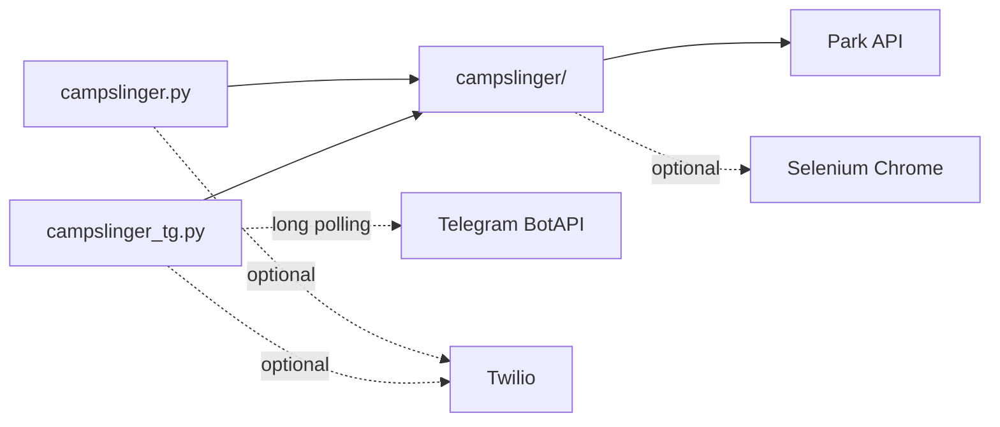
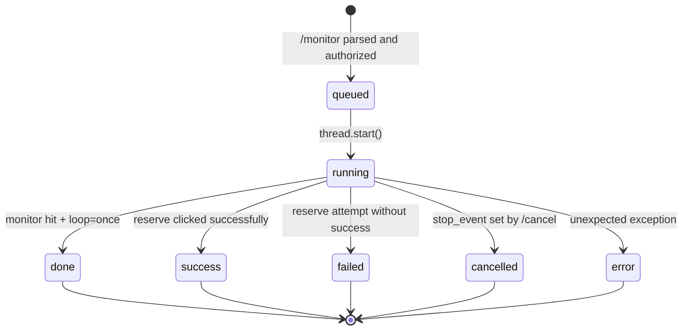

# Architecture

Internal layout and runtime behaviour of campslinger. For user-facing documentation see the [README](../README.md).

## Package layout

```text
campslinger/
├── campslinger.py            # CLI entrypoint (monitor + optional reserve)
├── campslinger_tg.py         # Telegram bot entrypoint
├── campslinger/              # shared library (the source of truth for behaviour)
│   ├── __init__.py           # __version__
│   ├── core.py               # park API: fetch_sites_map, fetch_park_name, label helpers
│   ├── log.py                # unified terminal + Telegram logging with digest dedup
│   ├── reserve_modes.py      # reserve_normal_mode, reserve_war_mode
│   ├── selenium_ops.py       # webdriver setup, map navigation, click flows
│   └── util.py               # URL validation, screenshot naming, SMS, helpers
├── docs/                     # this folder
├── _archive/                 # legacy scripts kept for reference
├── .env.example              # operator environment template
├── CHANGELOG.md
├── requirements.txt
└── README.md
```

## Module responsibilities

| Module | Responsibility |
|---|---|
| `core.py` | Stateless park-API client. Pulls site availability JSON and resolves the park's display name. The API base is derived from the booking URL host (`api_base_from_url`). |
| `log.py` | `pp()` is the single log entry point. In CLI mode it prints; in bot mode a `set_log_callback()` mirrors lines to Telegram, with an optional digest tuple to dedupe noisy "still polling" lines. |
| `reserve_modes.py` | High-level reservation strategies: `reserve_normal_mode` polls until a match is available then drives Selenium; `reserve_war_mode` prefetches the map at 06:59 and clicks Reserve at 07:00 (+ optional click-delay). |
| `selenium_ops.py` | All WebDriver interaction: `setup_webdriver`, `setup_webdriver_remote`, `prepare_reservation`, `get_available_sites`, `_dump_map_load_failure`. |
| `util.py` | URL allowlist + validation, descriptive screenshot path builder, comma list / sort helpers, SMS helper. |

## Shared library, thin entrypoints



Both entrypoints import the same package; behaviour parity is by construction.

## Telegram bot job lifecycle



### JobManager invariants

- `JobManager.create()` returns `None` if `len(active) >= max_concurrent` — the caller responds with "Server busy".
- Each job carries a `threading.Event` (`stop_event`). `JobManager.cancel_for_user()` sets it; the worker thread polls it during sleeps and inside `reserve_*_mode` between Selenium steps.
- All access to `active` and `recent` is under `self._lock`. The deque caps `recent` at `recent_max=40`.
- Per-user filtering (`*_for_user`) is the gate that keeps users from seeing each other's jobs.

## Logging digest deduplication

`pp(message, telegram_digest=...)` accepts an optional tuple identifying the *kind* of log line. Examples used in the code:

| Digest tuple | Meaning |
|---|---|
| `("zero",)` | "no availability" — same shape every poll. |
| `("filter_wait", frozenset(all_avail), tuple(args.filter or ()))` | "available, but none of your preferred sites" — collapses while the available set is unchanged. |
| `("api_err", str(e)[:220])` | API exception — collapses bursts of identical errors. |
| `None` | Always send to Telegram. |

If the new digest equals the previously recorded one (per-thread), the Telegram callback is skipped. Terminal output is always printed.

## Booking URL hardening

`util.validate_booking_url()` enforces, in order:

1. `scheme == "https"` (not `http`).
2. `hostname in SUPPORTED_PARK_HOSTS` — SSRF defence; the bot will only fetch known park hosts.
3. `path` starts with `/create-booking/`.
4. No embedded credentials (`user:pass@host` rejected).
5. Default port (`443`).

Adding a new park is a one-line change to `SUPPORTED_PARK_HOSTS`.

## Warmode timing

`reserve_war_mode` computes the next 07:00 boundary in `--timezone` (default `US/Pacific`) using `pytz` and `datetime`. It:

1. Sleeps until 06:59 (with `stop_event.wait()` so cancellations are responsive).
2. Loads the map and collects available icons (the prefetch step).
3. Sleeps until the 07:00 boundary.
4. Sleeps an additional `warmode_click_delay_ms` (default 0).
5. Clicks Reserve.

Local TZ on the host is irrelevant — only clock accuracy matters. NTP is recommended.

## Adding a new park platform

1. Append the hostname to `SUPPORTED_PARK_HOSTS` in [campslinger/util.py](../campslinger/util.py).
2. Update the table in [README.md](../README.md) → "Supported parks".
3. Smoke test with a real booking URL: `python3 -c "from campslinger.util import validate_booking_url; print(validate_booking_url('https://newhost.example/create-booking/results?...'))"`.
4. Run a monitor-only job to confirm the API answers (the JSON shape is shared across all Aspira / GoingToCamp parks).
